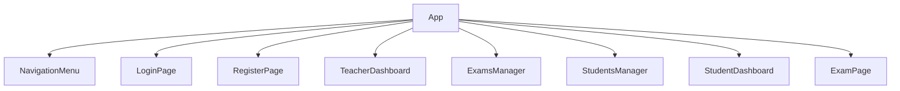
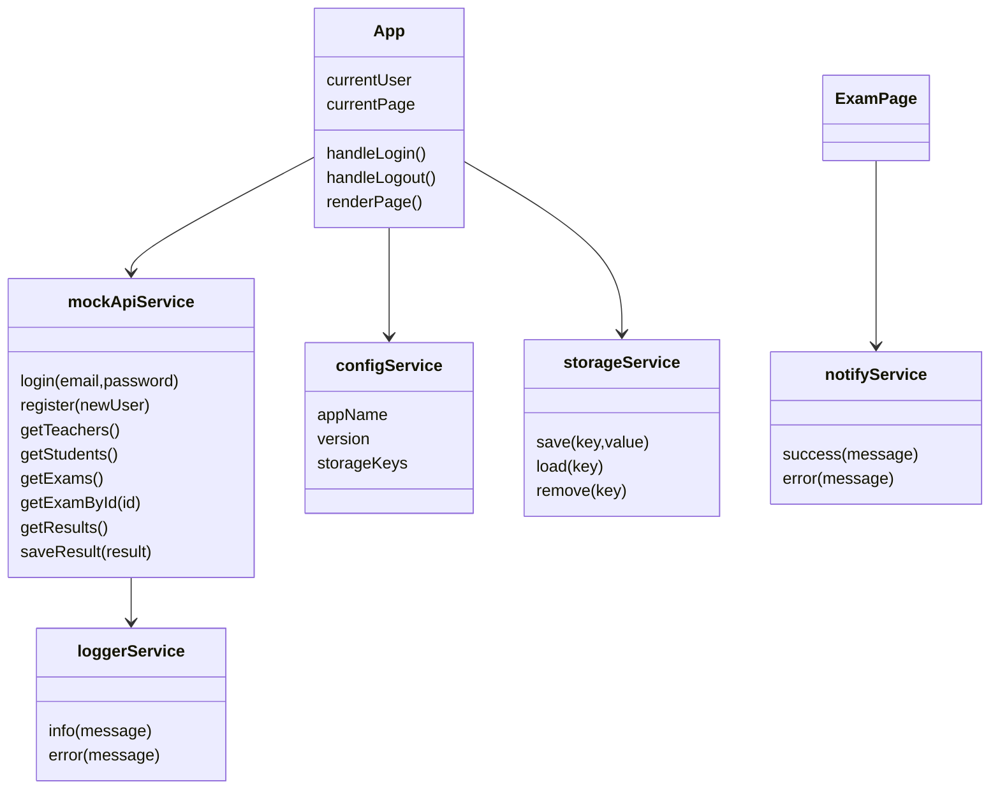
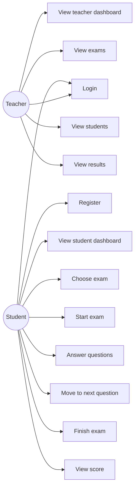

# ExamApp - Task 2 Documentation

## Project Goal
A full React application without a server. The app uses mock data, service layers, pages, components, authentication flow, teacher pages, student pages, navigation, and documentation diagrams.

## Main Entities Used by Mock DB / Views
- User: id, name, email, password, role
- Teacher: id, name, subject, email
- Student: id, name, email, className
- Exam: id, title, subject, duration, questions
- Question: id, text, options, correctAnswer
- Result: id, studentId, examId, score

## Components Hierarchy

## UML for Main Code

## Use Case Diagram

## Services
- mockApiService: simulates API calls using mock DB data.
- configService: stores app settings and storage keys.
- loggerService: logs app actions.
- storageService: saves and loads the current user from localStorage.
- notifyService: displays messages to users.

## Use Cases
### Teacher
- Login as teacher.
- View teacher dashboard statistics.
- View all exams.
- View all students.
- View latest results.

### Student
- Login or register.
- View available exams.
- Start an exam.
- Answer questions.
- Move between questions using Next.
- Finish the exam and receive a score.

## Test Users
- Teacher: teacher@app.com / 123456
- Student: student@app.com / 123456
